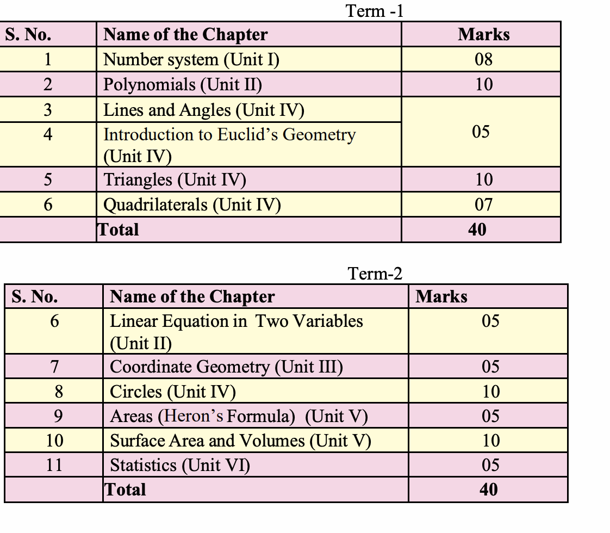

# MATH

1. UNIT I: NUMBER SYSTEMS
    1. REAL NUMBERS (18) Periods
        1. Review of representation of natural numbers, integers, and rational numbers on the number line.
        Rational numbers as recurring/ terminating decimals. Operations on real numbers.

        2. Examples of non-recurring/non-terminating decimals. Existence of non-rational numbers (irrational
        numbers) such as , and their representation on the number line. Explainingthat every real
        number is represented by a unique point on the number line and conversely, viz. every point on the
        number line represents a unique real number.

        3. Definition of nth root of a real number.

        4. Rationalization (with precise meaning) of real numbers of the type
        and (and their combinations) where x and y are natural number and a and b are integers.

        5. Recall of laws of exponents with integral powers. Rational exponents with positive real bases (to be
        done by particular cases, allowing learner to arrive at the general laws.) Logarithm concepts

2. UNIT II: ALGEBRA
    1. POLYNOMIALS (26) Periods
        Definition of a polynomial in one variable, with examples and counter examples. Coefficients of a
        polynomial, terms of a polynomial and zero polynomial. Degree of a polynomial. Constant, linear,
        quadratic and cubic polynomials. Monomials, binomials, trinomials. Factors and multiples. Zeros of a
        polynomial. Statement and proof of the Factor Theorem. Factorization of ax2 + bx + c, a ≠ 0 where a,
        b andc are real numbers, and of cubic polynomials using the Factor Theorem.
        Recall of algebraic expressions and identities. Verification of identities:
        and their use in factorization of polynomials.
    2. LINEAR EQUATIONS IN TWO VARIABLES (16) Periods
        Recall of linear equations in one variable. Introduction to the equation in two variables. Focus on
        linear equations of the type ax + by + c=0.Explain that a linear equation in twovariables has
        infinitely many solutions and justify their being written as ordered pairs of realnumbers, plotting
        them and showing that they lie on a line.

3. UNIT III: COORDINATE GEOMETRY
    1. COORDINATE GEOMETRY (7) Periods
        The Cartesian plane, coordinates of a point, names and terms associat

4. UNIT IV: GEOMETRY
    1. INTRODUCTION TO EUCLID'S GEOMETRY (7) Periods
        History - Geometry in India and Euclid's geometry. Euclid's method of formalizing observed
        phenomenon into rigorous Mathematics with definitions, common/obvious notions,
        axioms/postulates and theorems. The five postulates of Euclid. Showing the relationshipbetween
        axiom and theorem, for example:
    - (Axiom) 
        1. Given two distinct points, there exists one and only one line through them.(Theorem)
        2. (Prove) Two distinct lines cannot have more than one point in common.
    2. LINES AND ANGLES (15) Periods
        1. (Motivate) If a ray stands on a line, then the sum of the two adjacent angles so formed is 180O
        and the converse.
        2. (Prove) If two lines intersect, vertically opposite angles are equal.
        3. (Motivate) Lines which are parallel to a given line are parallel.
    3. TRIANGLES (22) Periods
        1. (Motivate) Two triangles are congruent if any two sides and the included angle of one triangleis
        equal to any two sides and the included angle of the other triangle (SAS Congruence).
        2. (Prove) Two triangles are congruent if any two angles and the included side of one triangle is
        equal to any two angles and the included side of the other triangle (ASA Congruence).
        3. (Motivate) Two triangles are congruent if the three sides of one triangle are equal to threesides of
        the other triangle (SSS Congruence).
        4. (Motivate) Two right triangles are congruent if the hypotenuse and a side of one triangle areequal
        (respectively) to the hypotenuse and a side of the other triangle. (RHS Congruence)
        5. (Prove) The angles opposite to equal sides of a triangle are equal.
        6. (Motivate) The sides opposite to equal angles of a triangle are equal.

    4. QUADRILATERALS (13) Periods
        1. (Prove) The diagonal divides a parallelogram into two congruent triangles.
        2. (Motivate) In a parallelogram opposite sides are equal, and conversely.
        3. (Motivate) In a parallelogram opposite angles are equal, and conversely.
        4. (Motivate) A quadrilateral is a parallelogram if a pair of its opposite sides is parallel and equal.
        5. (Motivate) In a parallelogram, the diagonals bisect each other and conversely.
        6. (Motivate) In a triangle, the line segment joining the mid points of any two sides is parallel to
        the third side and in half of it and (motivate) its converse.

    5. CIRCLES (17) Periods
        1. (Prove) Equal chords of a circle subtend equal angles at the center and (motivate) its converse.
        2. (Motivate) The perpendicular from the center of a circle to a chord bisects the chord and conversely,
        the line drawn through the center of a circle to bisect a chord is perpendicular tothe chord.
        3. (Motivate) Equal chords of a circle (or of congruent circles) are equidistant from the center(or
        their respective centers) and conversely.
        4. (Prove) The angle subtended by an arc at the center is double the angle subtended by it at anypoint
        on the remaining part of the circle.
        5. (Motivate) Angles in the same segment of a circle are equal.
        6. (Motivate) If a line segment joining two points subtends equal angle at two other points lying on the
        same side of the line containing the segment, the four points lie on a circle.
        7. (Motivate) The sum of either of the pair of the opposite angles of a cyclic quadrilateral is 180° and its
        converse

5. UNIT V: MENSURATION
    1. AREAS (5) Periods
        Area of a triangle using Heron's formula (without proof)
    2. SURFACE AREAS AND VOLUMES (17) Periods
        Surface areas and volumes of spheres (including hemispheres) and right circular cones.

6. UNIT VI: STATISTICS
    1. STATISTICS (15) Periods
        Bar graphs, histograms (with varying base lengths), and frequency polygons.

