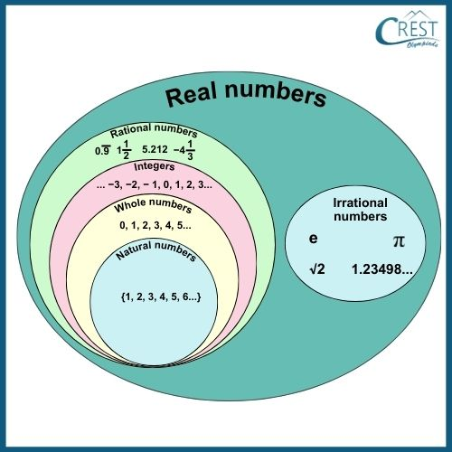
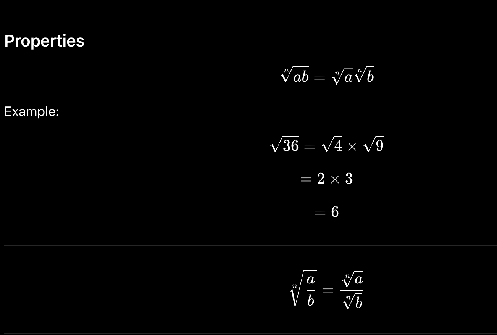

# REAL NUMBERS :

## 1. Review of Natural Numbers, Integers and Rational Numbers on the Number Line
1. Natural Numbers (N)
- Counting numbers:
    - N={1,2,3,4,…}
- Represented on the number line to the right of 0.

2. Whole Numbers (W)
W={0,1,2,3,4,…}
- Includes zero.

3. Integers (Z)
Z={…,−3,−2,−1,0,1,2,3,…}
- Contain positive numbers, negative numbers, and zero.
- Examples:
    - Temperature: A temperature can be below 0°C, such as −5°C.
    - Bank balance: If you owe ₹500, it can be represented as −500.
    - Elevators: Floors below ground level are denoted by negative numbers, such as −1 or −2.
    - Profit and loss: Profit may be +₹1000, while loss may be −₹1000.

4. Rational Numbers (Q)
- A number is rational if it `can be written` as:
where p,q are integers and q=0.
- EXAMPLE:
> 0/1 , 1/0 , -1/3 , 0.25 , 0.33 bar , π−3 , ln(2) , root2 * root 2 
> 0.999…=1 → rational.

- Representation on Number Line
- Example:
    - Divide the segment between 0 and 1 into 4 equal parts.
    - The third mark represents 

- Decimal Expansion of Rational Numbers
- Every rational number has either:
1. (a) Terminating Decimal
- Decimal ends after finite digits.

2. (b) Non-Terminating Recurring Decimal
- Decimal never ends but repeats a pattern.

- Condition for Terminating Decimal
- If the denominator (after simplification) has only factors 2 and/or 5.
- Examples: 
    - 3/8
        - Denominator: 2^3.
        Hence terminating.
    - 7/20 
        - 2*2*5
        Hence terminating.
    - 1/3
        - Denominator contains factor 3.
        Hence recurring.

## Operations on Real Numbers
1. Addition
2.5+3.2=5.7

2. Subtraction
8.7−2.4=6.3

3. Multiplication
1.5×2=3

4. Division
8÷4=2

### Properties
1. Closure Property
If a,b∈R
then
a+b∈R
a−b∈R
ab∈R

2. Commutative Property
a+b=b+a
ab=ba
Example:
2+5=5+2

3. Associative Property
(a+b)+c=a+(b+c)
(ab)c=a(bc)

4. Distributive Property
a(b+c)=ab+ac
Example:
2(3+4)=6+8=14

## 2. Irrational Numbers
- Numbers that cannot be written as
- Their decimal expansion is:
Non-terminating Non-recurring

- Examples:
- root 2 ,  π
- Decimal Expansion =1.414213562...
-  No repeating pattern.

- Proof that 2 is Irrational
    - squaring p/q=root2
    - both p and q should be even
    but also  p,q are coprime.
- Both p and q are even, contradicting that they are coprime.
hence irrational.

### Representation of Irrational Numbers on Number Line
- Example:  root2
- Take OA = 1 unit.
Draw AB = 1 unit perpendicular to OA.
Join OB.
> Using Pythagoras:
- With center O and radius OB, cut the number line.

## Real Numbers 
- Combination of:
Rational Numbers Q
and
Irrational Numbers Q′
- Together:
R=Q∪Q
′
- Important Fact
- Every real number corresponds to exactly one point on the number line.
And
- Every point on the number line corresponds to exactly one real number.
Hence number line is called the Real Line.

## 3. nth Root of a Real Number
- If
x^n=a
- then
x=nth root(a) 
is called the nth root of a.

- Properties

## 4. Rationalization
Meaning
- Converting a denominator containing irrational numbers into a rational number.
1. Rationalization of 1/root a

2. Rationalization of 1/a+root.b

2. Rationalization of 1/root.a+root.b

## 5. Laws of Exponents
...

## Logarithms
Logarithms are inverse operations of exponents.

