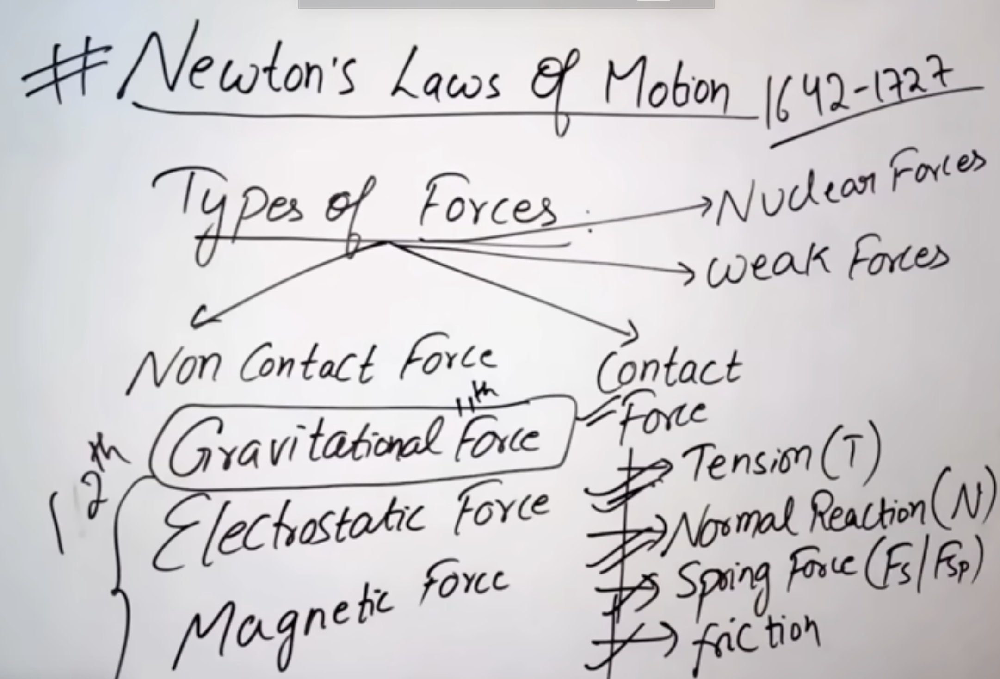
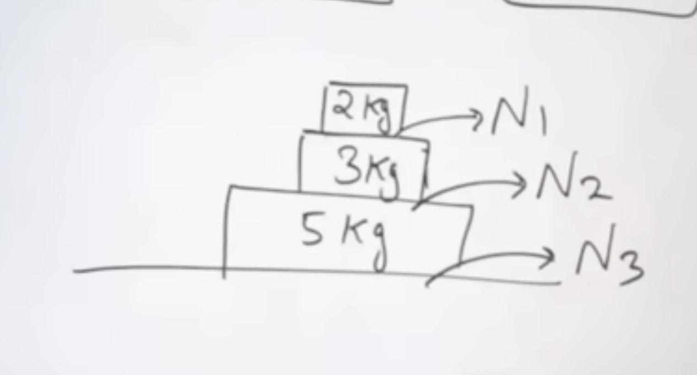
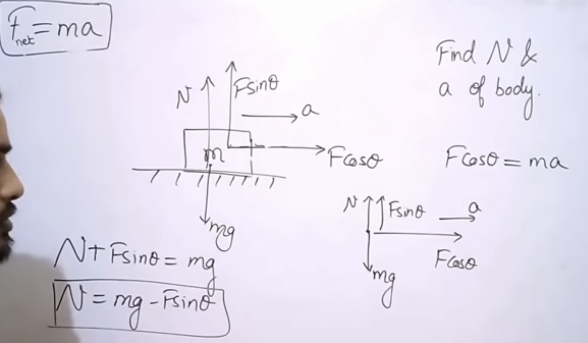

# 
- Before : kinematics whiech is effect .
- Now : fORCE which is cause.

## Forec changes state and shape and Direction.

## Types of Force :

# A Free Body Diagram (FBD) 
- is a sketch of an object isolated from its surroundings, showing all external forces acting on it.
- Steps to Draw a Free Body Diagram
    - Isolate the object you are analyzing.
    - Represent the object as a simple shape (dot, box, etc.).
    - Draw all external forces acting on the object as arrows.
    - Label each force clearly.
    - Choose a coordinate system if needed.

# QUESTION :

# NLM:

2. 

