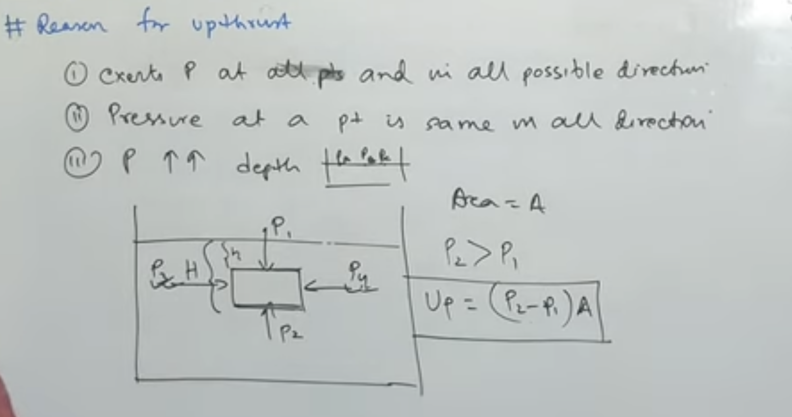

# 1. Thrust
- Thrust is the force acting on an object perpendicular to its surface.
SI Unit: Newton (N)
- Example: Water pressing against the wall of a dam exerts thrust.
Thrust=Force acting normally on a surface

Thrust , Normal Force , Buoyant Force , Pressure , Buoyancy 

2. Pressure
- Pressure is the thrust acting per unit area.
> Pressure tells us how concentrated a force is on a surface.
> P = Thrust / Area
    - Thrust : bcz perpendicular force is calculated 
- SI Unit: Pascal (Pa)
    - 1 Pascal = 1 N/m²
- Important Points
Greater force → greater pressure.
Smaller area → greater pressure.
- Examples
    Sharp knives cut easily because they have a small area.
    Broad foundations are used for buildings to reduce pressure on the ground.

3. Buoyancy
- When a body is immersed in a fluid (liquid or gas), the fluid exerts an upward force on it.
This upward force is called buoyant force or upthrust.
- Examples
A boat floats on water.
A balloon rises in air.
A stone feels lighter when submerged in water.

## 4. Archimedes' Principle
- When a body is wholly or partially immersed in a fluid, it experiences an upward force equal to the weight of the fluid displaced by it.
- Mathematically,
> Buoyant Force = Weight of Fluid Displaced
- Applications
    - Designing ships and boats.
    Submarines working underwater.
    Hydrometers for measuring relative density.
    Determining purity of metals.
    Hot-air balloons.
- F=ρVg
- where:
    Fb = buoyant force (N)
    ρ = density of the fluid (kg/m³)
    V = volume of fluid displaced (m³)
    g = acceleration due to gravity (9.81 m/s²)
- When an object is placed in a fluid (liquid or gas), the pressure at the bottom is greater than the pressure at the top because pressure increases with depth. This pressure difference creates an upward force called buoyancy.
> A point deeper in the water has more water above it than a point near the surface. The weight of this water presses down, so pressure increases with depth.
> P=ρgh
- hydrostatic pressure equation or fluid pressure formula.
- where:
    P = pressure
    ρ = density of fluid
    g = acceleration due to gravity
    h = depth.

5. Condition of Floatation
- A body floats when :
    - Weight of Body = Buoyant Force
- Cases
    Floats: Weight = Buoyant Force
    Sinks: Weight > Buoyant Force
    Remains suspended: Weight = Buoyant Force and densities are equal
- Density Rule
    - Density of object < Density of liquid → Floats
    - Density of object > Density of liquid → Sinks

### Upthrust (Buoyant Force) depends on:
1. Density of the fluid (ρ)
Denser fluids provide greater upthrust.
Example: Salt water gives more upthrust than fresh water.

2. Volume of fluid displaced
The more fluid an object displaces, the greater the upthrust.

3. Acceleration due to gravity (g)
Greater gravity means greater upthrust.

## 6. Relative Density (RD)
Relative density is the ratio of the density of a substance to the density of water at 4∘C.

Relative Density=
Density of Water
Density of Substance
	​

No unit (ratio of two similar quantities).

Example

If density of a substance = 2000kg/m
3
,

RD=
1000
2000
	​

=2
## 7. Specific Gravity

Specific Gravity is another name for Relative Density.

Specific Gravity=
Density of Water
Density of Substance
	​

Interpretation
Specific Gravity > 1 → Substance sinks in water.
Specific Gravity < 1 → Substance floats on water.